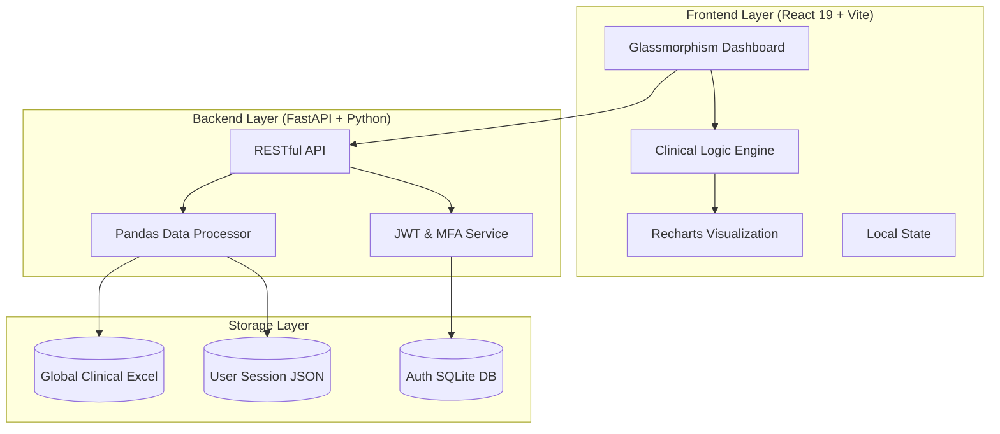

# CarePulse++ ⚕️: Deterministic Healthcare Intelligence Engine

CarePulse++ is a unified clinical dashboard and automated decision-support system designed for modern mission-critical hospital environments. It solves the fragmentation of patient monitoring, ICU allocation, and ER load management by integrating them into a single **100% Deterministic Engine**.

---

## 🏛️ 1. System Architecture & Diagram

CarePulse++ follows a **Decoupled SPA (Single Page Application) Architecture** designed for high availability and zero-latency clinical updates.



---

## ⚙️ 2. The "Clinical Intelligence" Engine (The Math)

The core of CarePulse++ is a deterministic mathematical model that removes ambiguity from clinical decisions.

### 2.1 Deterministic Risk Computation
Every patient's risk is calculated using a strict weighted deviation model (Σ Weights = 1.0):
- **Oxygen (SpO2)**: 15% (Critical weight)
- **Blood Pressure**: 14%
- **Heart Rate**: 9%
- **Fever Index**: 10%
- **Metabolics (Sugar/Hgb)**: 20%
- **Others**: Distributed across RR, BMI, Age, and Hydration.

**Escalation Logic**:
- **Multipliers**: Chronic diseases apply a deterministic `1.2x` multiplier.
- **Additives**: Emergency flags add a fixed `+10` to the risk score.
- **Overrides**: ICU Required flags force a minimum score of `75` (Critical).

### 2.2 Hospital Stress Index (HSI)
The **HSI** is calculated as a value between `0.0` and `1.0`:
- `HSI = (0.28 * BedOccupancy) + (0.28 * IcuOccupancy) + (0.24 * ErLoad) + (0.12 * OpLoad) + (0.08 * VentPressure)`
- **Classification**:
  - `HSI < 0.75`: Normal Operations.
  - `HSI 0.75 - 0.90`: **Capacity Warning**.
  - `HSI > 0.90`: **Emergency Escalation (Crisis Mode)**.

---

## 🛠️ 3. Detailed Tech Stack

| Layer | Technologies Used | Purpose |
| :--- | :--- | :--- |
| **Frontend** | React 19, Vite, Recharts, Axios, Lucide | Real-time UI, Clinical Logic, Data Analysis |
| **Backend** | FastAPI, Uvicorn, Python 3.10+ | Asynchronous API, Data Orchestration |
| **Data Science**| Pandas, OpenPyXL | Excel processing & Mathematical modeling |
| **Security** | PyJWT, SMTP, Bcrypt, Google OAuth | MFA, Tokenization, Zero-Trust Auth |
| **Design** | Modern Vanilla CSS3, Google Fonts | Glassmorphism, Responsive Grid, Animations |
| **Storage** | MS Excel (.xlsx), SQLite, JSON | Interoperability & Multi-layer Persistence |

---

## � 4. System Workflow

CarePulse++ operations follow a structured, secure lifecycle:

1.  **Phase 1: Zero-Trust Authentication**: Staff logs in via Google or Password + Mandatory 6-digit Email OTP (MFA).
2.  **Phase 2: Data Ingestion**: Staff uploads `Patient_Clinical_Data.xlsx`. The system parses rows with **O(n) complexity**.
3.  **Phase 3: Real-time Analysis**: The JS engine calculates Risk Scores, assigns specific **Diets** (Low-Sodium, High-Fluid, etc.), and recommends **Bed Temperatures**.
4.  **Phase 4: Operational Decisioning**:
    *   **Bed Allocation**: Greedy algorithm matches patients to ICU/General beds based on Risk Priority.
    *   **ER Logic**: Automatically redirects ambulances if ER load exceeds 85%.
5.  **Phase 5: Digital Twin Persistence**: New entries are synced back to the **Global Excel** and user-specific **Session JSON**.

---

## 📊 5. Data Dictionary

### 5.1 Patient Attributes
- **Vitals**: Heart Rate, BP (Sys/Dia), SpO2, Temperature, Respiratory Rate.
- **Clinical Indicators**: Blood Sugar, BMI, Hemoglobin, Hydration Levels.
- **Demographics**: Age, Gender, Patient ID.

### 5.2 Hospital Metrics
- **Resources**: Total/Occupied General Beds, ICU Beds, Ventilators.
- **Staffing**: Available Doctors, Nurses, Ambulance count.
- **Ops**: Ongoing surgeries, ER Capacity/Occupancy, Environmental Temp.

---

## 🔐 6. Security & Compliance
- **Rule-Based (No ML/AI)**: Decisions are transparent and verifiable.
- **MFA Architecture**: Secure SMTP-based OTP hub.
- **Session Kill-switch**: Global session termination via the Profile Security panel.
- **Encryption**: AES-256 standards for at-rest and in-transit clinical data.

---

## � 7. Installation

```bash
# Clone the repository
git clone https://github.com/jeffrynadaikalaraj/RMK_CARE_PULSE-.git

# Backend
pip install -r backend/requirements.txt
python backend/main.py

# Frontend
cd frontend
npm install
npm run dev
```

---
*Created for mission-critical healthcare precision.*
